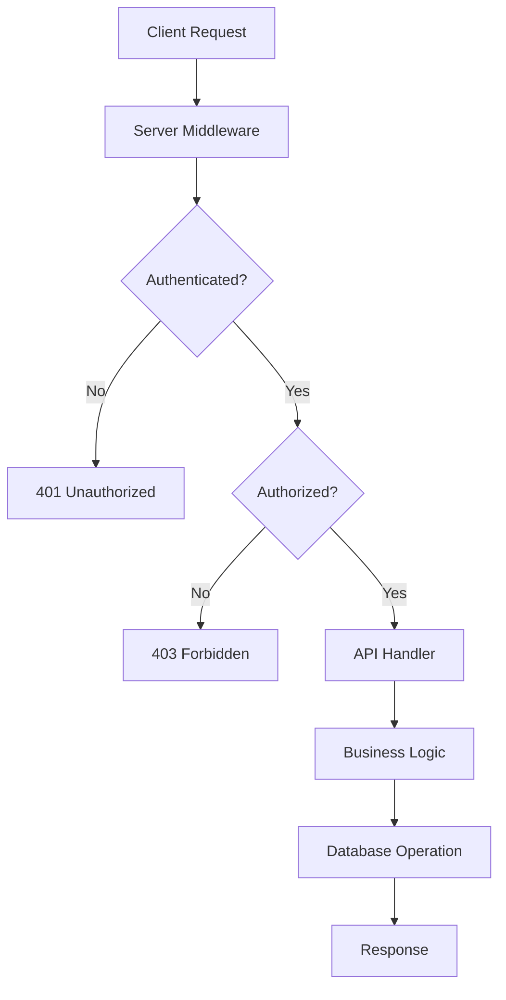
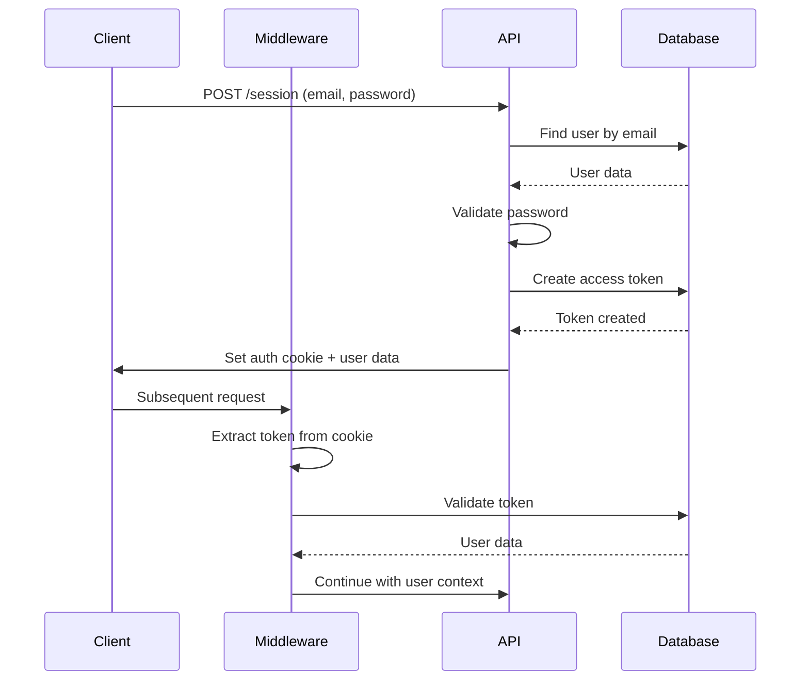
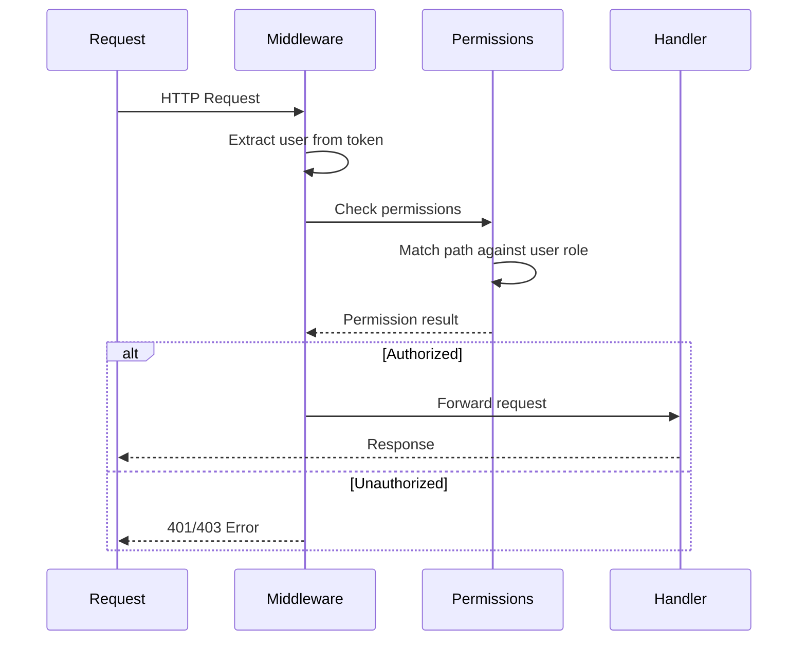

# Architecture

The Nuxt Users module is built with a layered architecture that provides authentication, authorization, and user management capabilities for Nuxt applications. This document explains the internal architecture, components, and data flow.

## Overview

The module follows a modular architecture with clear separation of concerns:

- **Module Layer**: Nuxt module configuration and setup
- **API Layer**: RESTful HTTP endpoints for user operations
- **Service Layer**: Business logic and data operations
- **Data Layer**: Database abstraction and utilities
- **Security Layer**: Authentication and authorization middleware
- **Client Layer**: Vue components and composables

## Core Components

### 1. Module Registration (`src/module.ts`)

The main module file handles:
- **Configuration Management**: Merges user options with defaults
- **Runtime Config Setup**: Configures server and client-side options
- **Route Registration**: Dynamically registers API endpoints
- **Component Registration**: Auto-registers Vue components
- **Middleware Setup**: Configures authentication middleware
- **Database Integration**: Sets up Nitro database configuration

Key responsibilities:
```typescript
// API endpoint registration with configurable base path
addServerHandler({
  route: `${base}/session`,
  method: 'post',
  handler: resolver.resolve('./runtime/server/api/nuxt-users/session/index.post')
})

// Nitro database configuration
nitroConfig.database.default = {
  connector: nitroConnector,
  options: connectorOptions
}
```

### 2. Database Layer

#### Database Abstraction (`src/runtime/server/utils/db.ts`)

Provides unified database access across multiple database types:
- **Connector Management**: Dynamic loading of database connectors
- **Connection Pooling**: Efficient database connection management
- **Error Handling**: Graceful handling of connection failures

Supported databases:
- SQLite (better-sqlite3)
- MySQL (mysql2)
- PostgreSQL (pg)

#### Database Utilities

**Table Creation**: Database-specific SQL for table creation
```typescript
// SQLite example
CREATE TABLE IF NOT EXISTS users (
  id INTEGER PRIMARY KEY AUTOINCREMENT,
  email TEXT NOT NULL UNIQUE,
  name TEXT NOT NULL,
  password TEXT NOT NULL,
  role TEXT NOT NULL DEFAULT 'user',
  created_at DATETIME DEFAULT CURRENT_TIMESTAMP,
  updated_at DATETIME DEFAULT CURRENT_TIMESTAMP
)
```

**Migration System**: Tracks and manages database schema changes
- Migrations table for version tracking
- CLI commands for database operations
- Rollback capabilities

### 3. Authentication System

#### Token-Based Authentication

The module uses personal access tokens for authentication:

**Token Storage**: Tokens stored in `personal_access_tokens` table
```typescript
interface PersonalAccessToken {
  id: number
  tokenable_type: string  // 'user'
  tokenable_id: number    // user ID
  name: string           // 'auth_token'
  token: string          // hashed token
  expires_at?: string    // optional expiration
  last_used_at?: string  // tracking usage
}
```

**Token Lifecycle**:
1. **Creation**: Generated during login with configurable expiration
2. **Validation**: Checked on each authenticated request
3. **Usage Tracking**: `last_used_at` updated on access
4. **Cleanup**: Expired tokens automatically removed

#### Password Security

**Hashing**: Uses bcrypt with salt rounds for password storage
```typescript
const hashedPassword = await bcrypt.hash(userData.password, 10)
```

**Validation**: Configurable password strength requirements
- Minimum length
- Character type requirements (uppercase, lowercase, numbers, special)
- Common password prevention

### 4. Authorization System

#### Role-Based Access Control (RBAC)

**Permission Structure**:
```typescript
type Permission = string | {
  path: string
  methods: HttpMethod[]
}

// Configuration example
permissions: {
  admin: ['*'],                    // Full access
  user: ['/profile', '/api/nuxt-users/me'],
  moderator: [
    { path: '/api/users/*', methods: ['GET', 'PATCH'] },
    '/admin/dashboard'
  ]
}
```

**Authorization Flow**:
1. **Token Extraction**: Get token from cookies
2. **User Resolution**: Find user from token
3. **Permission Check**: Match request path against user permissions
4. **Access Decision**: Allow/deny based on permissions

#### Middleware Architecture

**Server Middleware** (`authorization.server.ts`):
- Runs on every server request
- Handles API route protection
- Returns 401/403 for unauthorized access

**Client Middleware** (`authorization.client.ts`):
- Runs on client-side navigation
- Handles page-level protection
- Redirects to login for protected routes

### 5. API Layer

#### RESTful Endpoints

**Authentication Endpoints**:
- `POST /api/nuxt-users/session` - Login
- `DELETE /api/nuxt-users/session` - Logout

**User Management**:
- `GET /api/nuxt-users` - List users
- `POST /api/nuxt-users` - Create user
- `GET /api/nuxt-users/:id` - Get user
- `PATCH /api/nuxt-users/:id` - Update user
- `DELETE /api/nuxt-users/:id` - Delete user

**Profile Management**:
- `GET /api/nuxt-users/me` - Current user
- `PATCH /api/nuxt-users/me` - Update profile

**Password Management**:
- `PATCH /api/nuxt-users/password` - Change password
- `POST /api/nuxt-users/password/forgot` - Request reset
- `POST /api/nuxt-users/password/reset` - Reset password

#### Request/Response Flow



### 6. Service Layer

#### User Service (`src/runtime/server/utils/user.ts`)

Core user operations:
- **User CRUD**: Create, read, update, delete operations
- **Authentication**: Login validation and token management
- **Password Management**: Hashing, validation, reset functionality
- **Token Management**: Creation, validation, cleanup

#### Email Service

**Password Reset Flow**:
1. User requests password reset
2. Generate secure reset token
3. Send email with reset link
4. Validate token on reset
5. Update password and invalidate token

### 7. Client Layer

#### Vue Components

**Authentication Components**:
- `NUsersLoginForm`: Login form with validation
- `NUsersLogoutLink`: Logout functionality
- `NUsersResetPasswordForm`: Password reset form

**User Management Components**:
- `NUsersList`: User listing with pagination
- `NUsersUserCard`: User display card
- `NUsersUserForm`: User creation/editing form

**Utility Components**:
- `NUsersPasswordStrengthIndicator`: Real-time password validation
- `NUsersProfileInfo`: User profile display

#### Composables

**Client-side Authentication** (`useAuthentication.ts`):
```typescript
const { user, login, logout, isAuthenticated } = useAuthentication()
```

**Server-side Authentication** (`useServerAuth.ts`):
```typescript
const { getCurrentUser } = useServerAuth()
const user = await getCurrentUser(event)
```

### 8. Configuration System

#### Runtime Configuration

**Server Configuration**:
- Database connection settings
- Authentication options
- Email configuration
- Security settings

**Client Configuration**:
- Password validation rules
- API endpoints
- Public authentication settings

#### Environment-based Configuration

```typescript
// nuxt.config.ts
export default defineNuxtConfig({
  modules: ['nuxt-users'],
  nuxtUsers: {
    connector: {
      name: process.env.DB_TYPE || 'sqlite',
      options: {
        host: process.env.DB_HOST,
        // ... other options
      }
    }
  }
})
```

## Data Flow

### Authentication Flow



### Authorization Flow



## Security Considerations

### Token Security
- Tokens are hashed before storage
- Configurable expiration times
- Automatic cleanup of expired tokens
- Secure cookie settings

### Password Security
- bcrypt hashing with salt
- Configurable strength requirements
- Protection against common passwords

### Authorization Security
- Path-based permission matching
- Method-specific permissions
- Wildcard support for flexible rules
- Whitelist approach for public routes

## Performance Optimizations

### Database Optimizations
- Connection pooling
- Prepared statements via db0
- Efficient token cleanup
- Indexed columns for fast lookups

### Caching Strategy
- Runtime config caching
- Component auto-registration
- Middleware optimization

### Memory Management
- Automatic token cleanup
- Efficient user lookups
- Minimal data transfer

## Testing Architecture

The module includes comprehensive testing:

### Unit Tests
- API endpoint testing
- Middleware functionality
- Utility function validation
- Permission system testing

### Integration Tests
- End-to-end authentication flows
- Database operations
- Multi-database support

### Test Infrastructure
- Database-agnostic test setup
- Mock implementations
- Cleanup utilities
- Environment configuration

This architecture provides a robust, scalable, and secure foundation for user authentication and management in Nuxt applications.